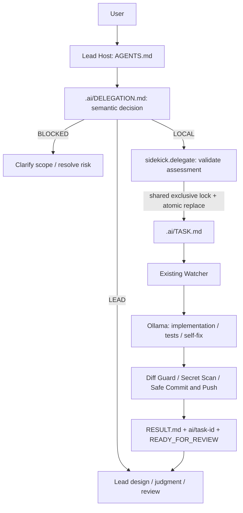

# Architecture Document: Local AI Sidekick (v1.0)

## 1. Overview

Local AI Sidekick is designed to drastically reduce expensive cloud/frontier AI token consumption by establishing a strict separation of concerns between high-level architectural reasoning and local execution:

- **Lead AI**: Operates at the architectural level, producing tasks, defining boundaries, and performing final code reviews.
- **Local Sidekick**: Operates locally within the repository, performing local exploration, code modifications, testing, self-fixing, and structured result generation.

Communication between Lead AI and Local Sidekick is file-mediated via local Markdown runtime documents (`.ai/TASK.md` / `.ai/RESULT.md`). The framework versions reusable examples under `templates/`; runtime task/result files are not part of the framework's tracked baseline.


```text
       Lead AI (Cloud / Frontier LLM)
                      │
           Writes .ai/TASK.md
                      ▼
               Local Repository
    ┌───────────────────────────────────┐
    │ .ai/                              │
    │  ├── RULES.md     (Permanent)     │
    │  ├── TASK.md      (Scope)         │
    │  ├── RESULT.md    (Output)        │
    │  └── DECISIONS.md (Immutable ADR) │
    └───────────────────────────────────┘
                      ▲
               Reads & Updates
                      │
         Local AI Sidekick (Runner)
    ┌───────────────────────────────────┐
    │ 1. Health & Model check (Ollama)  │
    │ 2. Security validator             │
    │ 3. Workspace file inspector       │
    │ 4. Local LLM invocation           │
    │ 5. Test execution & Self-fix      │
    │ 6. RESULT.md & Git diff summary   │
    └───────────────────────────────────┘
```

## Automatic Delegation



Root AGENTS.md is the repository entrypoint for Lead Hosts that load it,
including Codex/Astra-compatible hosts and Claude Code, which loads it (and
`.ai/DELEGATION.md` / `.ai/RULES.md`) automatically through the `@import`s in
[CLAUDE.md](../CLAUDE.md). There is no verified Astra/Antigravity proprietary
hook in this repository; other clients must attach AGENTS.md and the policy
as workspace instructions. Worker system prompts remain unchanged and never
invoke delegation.

The Lead makes the semantic decision and confidence assessment. The helper
fails closed on incomplete assessments, ambiguous scope, non-low risk, unknown
types, unsafe files/commands, or detected credentials. This is not a semantic
security classifier: falsely labeling a risky request low-risk must be avoided
by the Lead. Existing Worker security guards remain the execution boundary.

The helper's file scope is deliberately stricter than legacy tasks: concrete
files only, no workflow/instruction files, directories, globs or secret paths.
It appends mandatory Forbidden Operations and restricts verification commands
to a small reviewed list. Lead can extend the list through code review.

TASK publication and Watcher execution share an exclusive lock. The helper
flushes a same-directory temporary file then atomically replaces TASK.md;
it never modifies Worker status. Watcher reads after locking and persists
`processed_tasks: {task_id: task_hash}` before execution. Other state fields are
unchanged; legacy states load with empty history. Runner preserves this history.
Every attempted ID/hash is deduplicated, including BLOCKED, FAILED and crashes.
This provides at-most-once dispatch, not guaranteed completion after a crash.
History is local to this checkout and must be retained; removing it loses the
cross-task replay protection. Direct legacy runner invocation remains manual.

Stable content-derived IDs make identical helper submissions idempotent.
An unfinished task cannot be overwritten; a terminal task requires explicit
`--after-review` and a new ID for an intentional retry. RESULT changes never
trigger delegation. Stale locks are not stolen on timeout; recovery requires
verifying the owner stopped. State saves are atomic to avoid partial JSON.

See [README: Automatic Delegation](../README.md#automatic-delegation) for startup,
disable controls, host setup and troubleshooting. Queueing does not start a
Watcher, change Git settings, merge code or grant production/cloud permissions.

## 2. Directory Structure

```text
local-ai-sidekick/
├── AGENTS.md              # Lead entrypoint (Codex/Astra-compatible hosts)
├── CLAUDE.md              # Lead entrypoint for Claude Code (imports AGENTS.md + policy)
├── .ai/
│   ├── RULES.md           # Immutable security & behavior rules
│   ├── TASK.md            # Active task specification generated by Lead AI
│   ├── RESULT.md          # Structured execution output written by Sidekick
│   └── DECISIONS.md       # Architecture Decision Records (ADRs)
├── prompts/
│   └── sidekick-system.md # System prompt reinforcing Worker mindset
├── scripts/
│   ├── run-sidekick.ps1   # PowerShell runner for Windows environments
│   └── run-sidekick       # Bash runner for Linux/macOS
├── config/
│   └── sidekick.example.env # Configuration template
├── src/
│   └── sidekick/
│       ├── __init__.py
│       ├── cli.py         # Command-line interface
│       ├── config.py      # Environment and config loader
│       ├── ollama_client.py # Ollama API client (health, list, chat)
│       ├── runner.py      # 12-step execution orchestrator
│       ├── security.py    # Command & path allowlist, output redactor
│       ├── secret_scanner.py # Pre-commit secret scanning engine
│       ├── git_manager.py # Safe Git branching, diff guard, commit & push
│       ├── state_manager.py # State tracking (.ai/state.json) & lock manager
│       ├── watcher.py     # Background task watcher
│       ├── task_parser.py # TASK.md Markdown parser
│       └── workspace.py   # Safe file I/O and process execution
├── docs/
│   └── architecture.md    # This document
├── tests/
│   ├── test_sidekick_core.py # Phase 1 unit tests
│   ├── test_phase2_automation.py # Phase 2 git & diff guard unit tests
│   ├── test_phase2_e2e.py    # Phase 2 E2E integration test
│   └── fixtures/          # Verifiable fixture projects
└── README.md
```

## 3. Workflow Protocol

### Phase 1 Manual Mode
1. **Lead AI specifies task**: Writes `.ai/TASK.md`.
2. **Developer runs**: `.\scripts\run-sidekick.ps1`.
3. **Execution Pipeline**: Ollama check -> Task parse -> Local LLM -> Verification -> Self-fix -> RESULT.md -> Exit.

### Phase 2 Autonomous Git Mode
1. **Lead AI writes `.ai/TASK.md`** with `Task ID`.
2. **Watcher or Runner triggered**: `.\scripts\watch-sidekick.ps1` or `.\scripts\run-sidekick-phase2.ps1`.
3. **Git Preflight Check**: Confirms clean git working tree and remote configuration.
4. **Task Branch Creation**: Switches to or creates `ai/<task-id>`. Direct push to `main` is strictly forbidden.
5. **Implementation & Verification**: Local LLM edits allowed files, runs verification commands, and self-fixes if tests fail.
6. **Diff Guard**: Strictly validates modified files against `Allowed Files` before staging.
7. **Secret Scan**: Scans all modified files for tokens, keys, and credentials.
8. **Safe Commit & Push**: Commits changes and pushes only `origin ai/<task-id>`.
9. **Ready For Review**: Updates `.ai/state.json` and `.ai/RESULT.md` to `READY_FOR_REVIEW`.
10. **Lead AI Review**: Lead AI reviews the remote branch and `RESULT.md`.

## 4. Security & Safety Model

- **Worker Mindset**: Sidekick cannot make unilateral architectural changes. Ambiguities cause status `BLOCKED`.
- **Allowed Files Enforcement & Diff Guard**: Files outside `Allowed Files` cannot be edited or committed.
- **Protected Paths**: `.git`, `.env*`, and `.ai/DECISIONS.md` are strictly blocked.
- **Destructive Command Blocking**: Commands matching `rm -rf`, `git reset --hard`, `terraform apply`, `aws/gcloud/az write` are intercepted and denied.
- **Secret Redaction & Pre-commit Scanning**: Command outputs mask credentials, and git commits containing secrets are blocked.
- **Git Branch Protection**: Local LLM never executes raw git commands. Only trusted Python logic executes git operations. Direct commit or push to `main` is blocked.

## 5. Governance Integration

For independent verification, machine-readable phase boundaries, evidence generation, and Human merge approval, see [AI Engineering Factory Integration](factory-integration.md). Local AI Sidekick remains the Worker; the Factory remains the governance/verifier layer.

## 6. References

- [Cognition: Local Fusion](https://cognition.com/blog/local-fusion)

